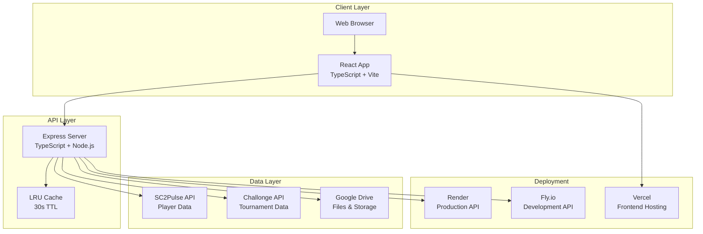
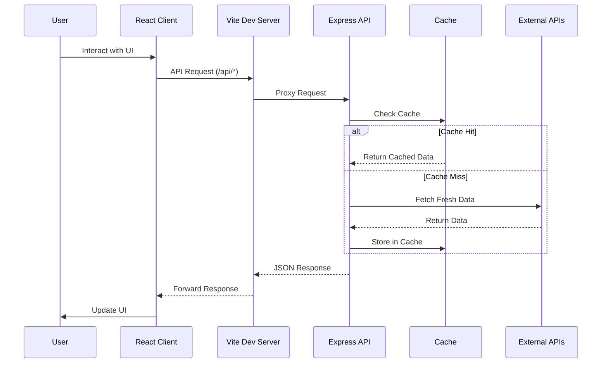
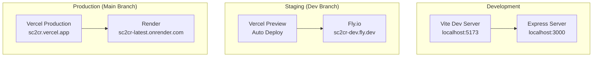
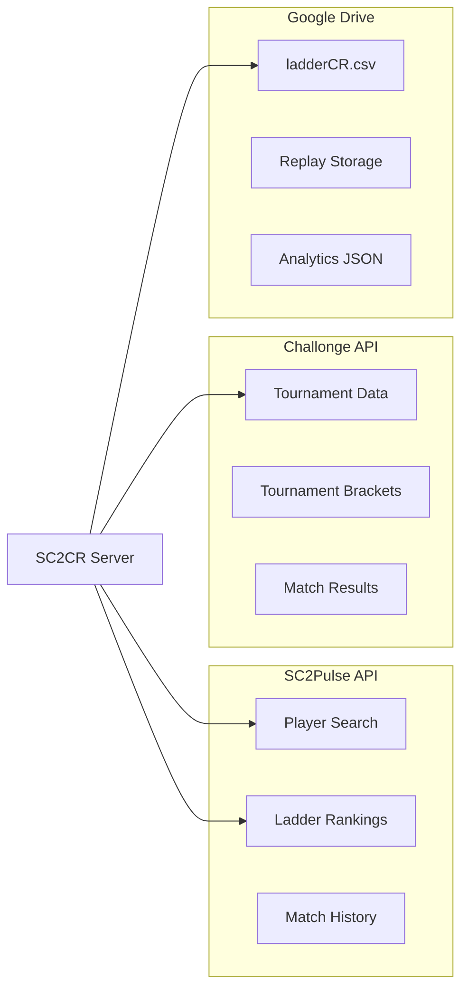
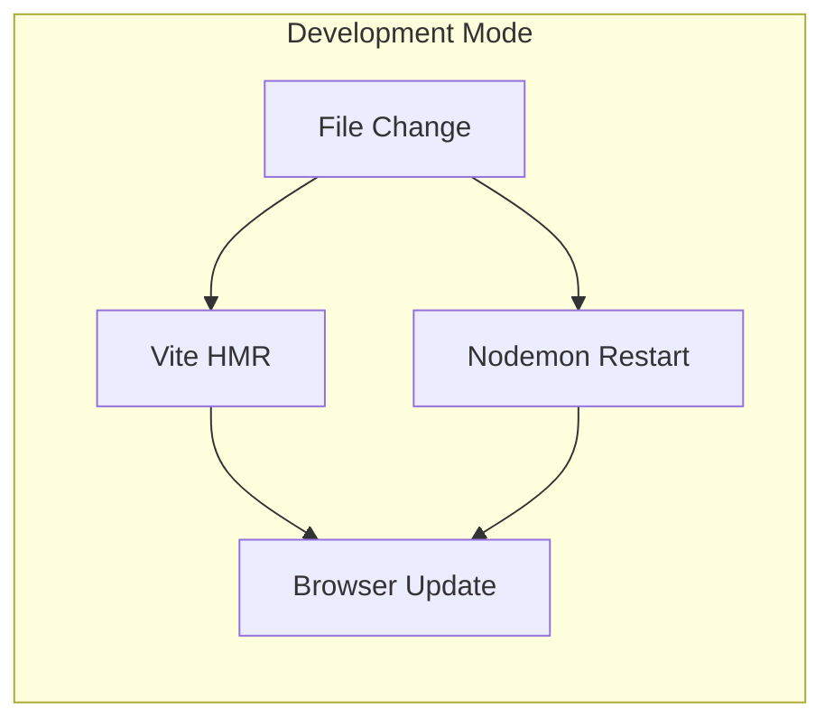

# Architecture Overview

> **Understanding SC2CR's system design** - How all the pieces fit together

## 🎯 Architecture Goals

SC2CR is designed with these principles in mind:

- **🚀 Performance**: Fast data loading and responsive UI through caching and optimization
- **📈 Scalability**: Multi-environment deployment with horizontal scaling capability  
- **🔧 Maintainability**: Clear separation of concerns between frontend, backend, and data layers
- **🌐 Reliability**: Robust error handling and fallback mechanisms for external dependencies
- **👥 Developer Experience**: Hot reload, type safety, and comprehensive tooling

---

## 🏗️ System Overview

### High-Level Architecture



### Technology Stack

| Layer | Technology | Purpose | Key Features |
|-------|------------|---------|--------------|
| **Frontend** | React 18 + TypeScript | UI and user interactions | Hot reload, type safety, component reusability |
| **UI Framework** | Mantine v7 | Component library | Consistent design system, accessibility |
| **Build Tool** | Vite | Development and bundling | Fast HMR, optimized production builds |
| **Backend** | Express + TypeScript | API server and business logic | RESTful APIs, middleware pipeline |
| **Runtime** | Node.js 18+ | JavaScript execution | Modern ES features, npm ecosystem |
| **Data Sources** | External APIs | Real-time game data | SC2Pulse, Challonge, Google Drive |
| **Caching** | LRU Cache | Performance optimization | In-memory cache with TTL |
| **Deployment** | Vercel + Render/Fly.io | Multi-environment hosting | Automatic deployments, scaling |

---

## 🔄 Data Flow Architecture

### Request Flow Diagram



### Data Processing Pipeline

1. **Request Initiation**: User interaction triggers React component
2. **API Call**: Custom hook (`useFetch`) makes HTTP request
3. **Proxy Handling**: Vite dev server proxies `/api/*` to Express server
4. **Cache Check**: Express checks LRU cache for existing data
5. **External Fetch**: If cache miss, fetch from SC2Pulse/Challonge/Google Drive
6. **Data Transform**: Process and validate external API responses
7. **Cache Store**: Store processed data with 30-second TTL
8. **Response**: Return JSON to client
9. **UI Update**: React updates components with new data

---

## 🎨 Frontend Architecture

### Component Hierarchy

```
App.tsx (Router + Layout)
├── Layout Components
│   ├── Header.tsx (Navigation)
│   ├── Footer.tsx (Links)
│   └── ErrorBoundary.tsx (Error handling)
├── Pages (Route Components)  
│   ├── Home.tsx (Landing page)
│   ├── Rankings.tsx (Player rankings)
│   ├── PlayerProfile.tsx (Individual player)
│   └── Analytics.tsx (Community stats)
└── Shared Components
    ├── PlayerCard.tsx (Player display)
    ├── RankingTable.tsx (Data tables)
    ├── Charts/ (Data visualization)
    └── UI/ (Reusable UI elements)
```

### State Management Strategy

- **Local State**: React `useState` for component-specific data
- **Server State**: Custom hooks (`useFetch`, `usePost`) with caching
- **URL State**: React Router for navigation and deep linking
- **Global State**: React Context for theme and user preferences

### Key Frontend Patterns

```typescript
// Custom API Hook Pattern
const useFetch = <T>(endpoint: string) => {
  const [data, setData] = useState<T | null>(null)
  const [loading, setLoading] = useState(true)
  const [error, setError] = useState<string | null>(null)
  
  // Fetch logic with error handling and caching
}

// Component with API Integration
export const RankingsPage = () => {
  const { data: rankings, loading, error } = useFetch<RankingRow[]>('ranking')
  const { data: snapshot } = useFetch<SnapshotData>('snapshot')
  
  const enrichedRankings = useMemo(() => 
    addPositionChangeIndicator(rankings, snapshot), 
    [rankings, snapshot]
  )
  
  if (loading) return <LoadingSpinner />
  if (error) return <ErrorMessage error={error} />
  
  return <RankingTable data={enrichedRankings} />
}
```

**📖 Want frontend details?** → [**Frontend Architecture Guide**](frontend.md)

---

## ⚙️ Backend Architecture

### API Structure

```
src/server/
├── server.ts (Entry point)
├── routes/
│   ├── apiRoutes.ts (Main router)
│   ├── pulseRoutes.ts (SC2Pulse endpoints)
│   ├── challongeRoutes.ts (Tournament endpoints)
│   ├── googleRoutes.ts (Drive/Storage endpoints)
│   └── utilityRoutes.ts (Health/Debug endpoints)
├── services/
│   ├── pulseService.ts (SC2Pulse integration)
│   ├── challongeApi.ts (Challonge integration)
│   ├── googleApi.ts (Google Drive client)
│   └── analyticsService.ts (Data processing)
├── utils/
│   ├── cache.ts (LRU caching)
│   ├── errorHandler.ts (Error processing)
│   └── validation.ts (Data validation)
└── middleware/
    ├── cors.ts (CORS handling)
    ├── rateLimiting.ts (API rate limits)
    └── logging.ts (Request logging)
```

### Service Layer Pattern

```typescript
// Service Interface
interface PlayerService {
  searchPlayers(query: string): Promise<Player[]>
  getPlayerProfile(btag: string): Promise<PlayerProfile>
  getPlayerRankings(): Promise<RankingRow[]>
}

// Implementation with Caching
class SC2PulseService implements PlayerService {
  private cache = new LRUCache<string, any>({ max: 1000, ttl: 30000 })
  
  async searchPlayers(query: string): Promise<Player[]> {
    const cacheKey = `search:${query}`
    
    if (this.cache.has(cacheKey)) {
      return this.cache.get(cacheKey)!
    }
    
    const players = await this.fetchFromSC2Pulse(query)
    this.cache.set(cacheKey, players)
    return players
  }
}
```

### Error Handling Strategy

```typescript
// Standardized Error Response
interface APIError {
  error: string
  code: string
  context?: Record<string, any>
}

// Global Error Handler
app.use((err: Error, req: Request, res: Response, next: NextFunction) => {
  logger.error('API Error', { error: err.message, stack: err.stack })
  
  if (err instanceof ValidationError) {
    return res.status(400).json({
      error: 'Invalid input data',
      code: 'VALIDATION_ERROR', 
      context: err.details
    })
  }
  
  res.status(500).json({
    error: 'Internal server error',
    code: 'INTERNAL_ERROR'
  })
})
```

**🔧 Want backend details?** → [**Backend Architecture Guide**](backend.md)

---

## 🌐 Deployment Architecture

### Environment Strategy



### CI/CD Pipeline

```yaml
# .github/workflows/Deploy.yml
name: Deploy Pipeline
on:
  push:
    branches: [main, dev]
  pull_request:
    branches: [main, dev]

jobs:
  quality-checks:
    - Lint (ESLint)
    - Type Check (TypeScript)
    - Tests (Vitest)
    - Build Verification
  
  docker-build:
    - Build Docker image
    - Push to Docker Hub
    - Push to Fly.io registry
  
  deploy:
    - Frontend: Auto-deploy via Vercel
    - Backend: Deploy to Render (main) or Fly.io (dev)
```

### Configuration Management

```typescript
// Environment-aware configuration
interface EnvironmentConfig {
  apiUrl: string
  features: {
    analytics: boolean
    snapshots: boolean
    barcodeHelper: boolean
  }
}

// Client-side environment detection
const getConfig = (): EnvironmentConfig => {
  const hostname = window.location.hostname
  
  if (hostname.includes('localhost')) {
    return localConfig
  } else if (hostname.includes('sc2cr.vercel.app')) {
    return productionConfig
  } else {
    return developmentConfig
  }
}
```

**🚀 Want deployment details?** → [**Deployment Architecture Guide**](deployment.md)

---

## 📊 Data Architecture

### External Data Sources



### Caching Strategy

- **L1 Cache**: Browser HTTP cache (static assets)
- **L2 Cache**: Service Worker cache (offline capability)  
- **L3 Cache**: Server-side LRU cache (API responses)
- **L4 Cache**: External API rate limiting and caching

### Data Processing Flow

1. **Ingestion**: Fetch from external APIs
2. **Validation**: Zod schemas for type safety
3. **Transformation**: Normalize data formats
4. **Enrichment**: Add calculated fields (position changes, statistics)
5. **Caching**: Store processed results
6. **Delivery**: Serve to frontend clients

---

## 🔐 Security Architecture

### API Security

- **CORS Configuration**: Whitelist allowed origins
- **Rate Limiting**: Prevent API abuse (express-rate-limit)
- **Input Validation**: Zod schemas for all inputs
- **Error Sanitization**: No sensitive data in error responses
- **Environment Variables**: Secure credential management

### Data Security

- **No PII Storage**: Only public game statistics
- **API Key Management**: Environment-based configuration
- **Secure Communication**: HTTPS in production
- **Access Control**: Service account permissions for Google Drive

---

## 📈 Performance Architecture

### Optimization Strategies

- **Code Splitting**: Route-based chunks for faster initial load
- **Tree Shaking**: Remove unused code in production builds
- **Image Optimization**: Optimized assets via Vercel
- **Compression**: Gzip/Brotli for API responses
- **CDN**: Global content distribution via Vercel Edge

### Monitoring & Observability

```typescript
// Built-in performance monitoring
const performanceMetrics = {
  apiResponseTimes: new Map<string, number[]>(),
  errorRates: new Map<string, number>(),
  cacheHitRates: new Map<string, number>()
}

// Endpoint: GET /api/debug?type=metrics
export const getMetrics = () => ({
  pulse_p95_ms: calculatePercentile(performanceMetrics.apiResponseTimes.get('pulse'), 95),
  pulse_p99_ms: calculatePercentile(performanceMetrics.apiResponseTimes.get('pulse'), 99),
  cache_hit_rate: performanceMetrics.cacheHitRates.get('global'),
  error_rate: performanceMetrics.errorRates.get('global')
})
```

---

## 🔧 Development Architecture

### Hot Reload Development



### Build System

```typescript
// Unified build process
const buildProcess = {
  client: 'vite build',           // Optimized React bundle
  server: 'node scripts/build.cjs', // TypeScript compilation + assets
  docker: 'docker build',        // Container packaging
  deploy: 'CI/CD pipeline'       // Automated deployment
}
```

### Code Quality Pipeline

- **Pre-commit**: Husky + lint-staged for code quality
- **CI Checks**: Automated linting, type checking, testing
- **Code Review**: PR-based review process
- **Automated Testing**: Unit + integration test suites

---

## 📚 Architecture Decisions

### Key Design Decisions

1. **TypeScript Everywhere**: Type safety across frontend and backend
2. **Trunk-Based Development**: Simple branching with dev → main promotion
3. **API-First Design**: Clear separation between client and server
4. **Caching Strategy**: Multi-level caching for performance
5. **Environment Parity**: Consistent behavior across dev/staging/production

### Trade-offs Made

| Decision | Benefits | Trade-offs |
|----------|----------|------------|
| **Single Repository** | Simplified development, shared types | Larger checkout, coupled deployments |
| **In-Memory Cache** | Simple implementation, fast access | Lost on server restart, no persistence |
| **External APIs Only** | No database maintenance, real-time data | External dependencies, rate limits |
| **Multi-Environment** | Safe staging, production isolation | Complex deployment pipeline |

### Future Considerations

- **Database Layer**: For user accounts and custom features
- **Real-time Updates**: WebSocket integration for live data
- **Microservices**: Service separation as system grows
- **Edge Computing**: Regional deployment for global performance

---

## 🔗 Related Documentation

### Deep Dive Guides
- [**Frontend Architecture**](frontend.md) - React/TypeScript client design
- [**Backend Architecture**](backend.md) - Express API server design  
- [**Data Flow Diagrams**](data-flow.md) - Detailed request/response flows
- [**Deployment Architecture**](deployment.md) - Multi-environment deployment

### Implementation Guides  
- [**Development Setup**](../development/README.md) - Local development environment
- [**API Documentation**](../api/README.md) - REST endpoint specifications
- [**Testing Strategy**](../development/testing.md) - Quality assurance approach

### Reference Materials
- [**Environment Variables**](../reference/environment-variables.md) - Configuration options
- [**External APIs**](../reference/external-apis.md) - Third-party integrations

---

*Last updated: October 2025 | [Improve this guide](https://github.com/KvCG/sc2crpage/edit/dev/docs/architecture/README.md)*