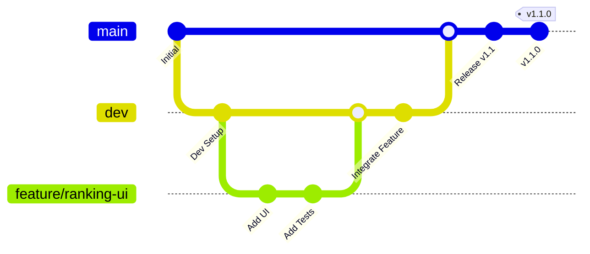

# Development Workflow

> **Complete guide to contributing to SC2CR** - Git flow, coding standards, and best practices

## 🎯 Workflow Overview

SC2CR uses a **trunk-based development workflow** centered around the `dev` branch for fast iteration and safe deployment.

### Key Principles
- **🔄 Trunk-Based**: All development flows through `dev` branch
- **🚀 Fast Iteration**: Quick feedback loops with automated testing
- **🛡️ Safe Deployment**: Selective promotion from `dev` to `main`
- **🤝 Collaboration**: PR-based review process
- **📋 Quality First**: Automated checks for code quality and functionality

---

## 🌳 Branching Strategy

### Branch Structure



### Branch Types

| Branch | Purpose | Lifetime | Merge Target |
|--------|---------|----------|--------------|
| **`main`** | Production releases | Permanent | N/A |
| **`dev`** | Integration branch | Permanent | `main` (via release) |
| **`feature/*`** | New features | Short-lived | `dev` |
| **`fix/*`** | Bug fixes | Short-lived | `dev` |
| **`release/*`** | Release preparation | Short-lived | `main` |

### Daily Development Flow

```bash
# 1. Start from dev (always up-to-date)
git checkout dev
git pull origin dev

# 2. Create feature branch
git checkout -b feature/player-analytics
# or: git checkout -b fix/ranking-bug

# 3. Develop with regular commits
git add .
git commit -m "feat(analytics): add player statistics endpoint"

# 4. Push branch and create PR
git push origin feature/player-analytics
# Create PR targeting dev branch via GitHub UI

# 5. After PR merge, clean up
git checkout dev
git pull origin dev
git branch -d feature/player-analytics
```

---

## 🔄 Release Process

### Selective Release Strategy

Instead of releasing everything in `dev`, we curate releases by selecting specific features:

```bash
# 1. Prepare curated release from dev
git checkout dev
git pull origin dev
git checkout -b temp-release-prep

# 2. Interactive rebase to curate changes
git rebase -i origin/main
# Use pick/squash/drop to select which changes to include

# 3. Create release branch from main
git checkout main  
git pull origin main
git checkout -b release/1.2.0

# 4. Merge curated changes
git merge --no-ff temp-release-prep

# 5. Create PR to main for review
# After PR approval and merge:
git checkout main
git pull origin main
git tag v1.2.0
git push origin main --tags

# 6. Clean up temporary branch
git branch -D temp-release-prep
```

### Release Types

- **Major (x.0.0)**: Breaking changes, major new features
- **Minor (1.x.0)**: New features, API additions  
- **Patch (1.1.x)**: Bug fixes, small improvements

---

## 📝 Commit Standards

### Conventional Commits Format

```bash
<type>(<scope>): <description>

[optional body]

[optional footer(s)]
```

### Commit Types

| Type | Purpose | Example |
|------|---------|---------|
| **feat** | New features | `feat(api): add player search endpoint` |
| **fix** | Bug fixes | `fix(ui): resolve ranking table sorting issue` |
| **docs** | Documentation | `docs(setup): update installation instructions` |
| **style** | Code formatting | `style(client): fix ESLint warnings` |
| **refactor** | Code restructuring | `refactor(services): extract common API logic` |
| **test** | Testing changes | `test(ranking): add integration tests` |
| **chore** | Maintenance tasks | `chore(deps): update React to v18.3.1` |
| **ci** | CI/CD changes | `ci(deploy): add Fly.io deployment config` |

### Scope Guidelines

| Scope | Coverage |
|-------|----------|
| **api** | Backend API endpoints and logic |
| **ui** | Frontend components and UI |
| **client** | Frontend application logic |
| **server** | Backend server configuration |
| **services** | External API integrations |
| **auth** | Authentication and authorization |
| **db** | Database and data layer |
| **config** | Configuration and environment |
| **docs** | Documentation updates |

### Commit Examples

```bash
# Good commits
feat(api): add player analytics endpoint with caching
fix(ui): resolve mobile navigation menu overflow
docs(architecture): add data flow diagrams
test(services): add SC2Pulse API integration tests
refactor(client): extract reusable chart components

# Poor commits (avoid these)
fix stuff
update files
WIP
asdf
commit
```

---

## 🧪 Quality Standards

### Code Quality Checklist

Before submitting any PR, ensure:

#### ✅ Linting and Formatting
```bash
npm run lint          # ESLint checks pass
npm run type-check    # TypeScript compilation succeeds
# Code is auto-formatted by Prettier
```

#### ✅ Testing
```bash
npm test             # All tests pass
npm run coverage     # Coverage maintained or improved
# New features include tests
# Bug fixes include regression tests
```

#### ✅ Build Verification
```bash
npm run build        # Production build succeeds
npm start           # Production server starts correctly
# No console errors in browser
```

### Code Review Standards

#### PR Requirements
- **Clear Title**: Follows conventional commit format
- **Description**: Explains what and why, not just what
- **Testing**: Describes how changes were tested
- **Screenshots**: For UI changes, include before/after images
- **Breaking Changes**: Clearly marked and documented

#### Review Criteria
- **Functionality**: Code works as intended
- **Code Quality**: Follows project patterns and standards  
- **Performance**: No obvious performance regressions
- **Security**: No security vulnerabilities introduced
- **Documentation**: Updates documentation when needed

---

## 🤝 Collaboration Guidelines

### Pull Request Process

#### 1. Pre-PR Checklist
```bash
# Update from dev
git checkout dev && git pull origin dev
git checkout your-branch && git rebase dev

# Quality checks
npm run lint && npm run type-check && npm test && npm run build

# Commit message review
git log --oneline -5  # Check recent commits follow standards
```

#### 2. PR Creation
- **Target**: Always target `dev` branch (not `main`)
- **Title**: Use conventional commit format
- **Description**: Use PR template (if available)
- **Labels**: Add appropriate labels (bug, feature, documentation, etc.)
- **Reviewers**: Request review from maintainers or relevant developers

#### 3. PR Review Process
- **Author**: Respond to feedback promptly and professionally
- **Reviewers**: Provide constructive, actionable feedback  
- **Discussion**: Use PR comments for technical discussion
- **Changes**: Push additional commits to address feedback

#### 4. PR Merge
- **Approval**: Minimum 1 approval from maintainer
- **Checks**: All CI checks must pass
- **Method**: Squash and merge (maintains clean history)
- **Cleanup**: Delete branch after merge

### Code Review Best Practices

#### For Authors
- **Small PRs**: Keep changes focused and reviewable
- **Context**: Provide sufficient context in description
- **Self-Review**: Review your own code before requesting review
- **Responsiveness**: Address feedback within 24-48 hours
- **Testing**: Include evidence of testing (screenshots, logs, etc.)

#### For Reviewers  
- **Timeliness**: Review within 24-48 hours of request
- **Constructiveness**: Focus on improvement, not criticism
- **Specificity**: Provide specific, actionable suggestions
- **Praise**: Acknowledge good code and clever solutions
- **Questions**: Ask questions to understand design decisions

---

## 🛠️ Development Environment Setup

### Required Tools
```bash
# Core requirements
node --version    # 18.x or higher
npm --version     # 9.x or higher
git --version     # Recent version

# Recommended VS Code extensions
code --install-extension ms-vscode.vscode-typescript-next
code --install-extension esbenp.prettier-vscode
code --install-extension ms-vscode.vscode-eslint
```

### Project Setup
```bash
# Clone and setup
git clone https://github.com/KvCG/sc2crpage.git
cd sc2crpage
npm install

# Configure Git (if not already done)
git config --global user.name "Your Name"
git config --global user.email "your.email@example.com"

# Start development
npm run dev
```

### IDE Configuration

#### VS Code Settings (`.vscode/settings.json`)
```json
{
  "editor.formatOnSave": true,
  "editor.codeActionsOnSave": {
    "source.fixAll.eslint": true
  },
  "typescript.preferences.importModuleSpecifier": "relative"
}
```

#### Git Configuration
```bash
# Recommended Git aliases
git config --global alias.co checkout
git config --global alias.br branch  
git config --global alias.ci commit
git config --global alias.st status
git config --global alias.unstage 'reset HEAD --'
git config --global alias.last 'log -1 HEAD'
git config --global alias.visual '!gitk'
```

---

## 🔧 Common Workflows

### Adding a New Feature

```bash
# 1. Start from updated dev
git checkout dev && git pull origin dev

# 2. Create feature branch
git checkout -b feature/tournament-brackets

# 3. Develop incrementally
# Make small, focused commits as you develop
git add src/components/TournamentBracket.tsx
git commit -m "feat(ui): add tournament bracket component"

git add src/services/challongeApi.ts
git commit -m "feat(api): add Challonge bracket API integration"

git add src/pages/Tournament.tsx
git commit -m "feat(ui): add tournament page with bracket display"

# 4. Add tests
git add src/components/__tests__/TournamentBracket.test.tsx
git commit -m "test(ui): add tournament bracket component tests"

# 5. Update documentation
git add docs/features/tournament-integration.md
git commit -m "docs(features): document tournament bracket feature"

# 6. Final quality check
npm run lint && npm run type-check && npm test && npm run build

# 7. Push and create PR
git push origin feature/tournament-brackets
# Create PR via GitHub UI targeting dev branch
```

### Fixing a Bug

```bash
# 1. Start from dev
git checkout dev && git pull origin dev

# 2. Create fix branch
git checkout -b fix/ranking-position-indicators

# 3. Reproduce and fix
# Add failing test first (TDD approach)
git add src/utils/__tests__/rankingHelper.test.ts
git commit -m "test(ranking): add failing test for position indicator bug"

# Fix the issue
git add src/utils/rankingHelper.ts
git commit -m "fix(ranking): correct position change indicator calculation"

# 4. Verify fix
npm test  # Ensure tests pass
npm run dev  # Manual verification

# 5. Push and create PR
git push origin fix/ranking-position-indicators
```

### Updating Dependencies

```bash
# 1. Create chore branch  
git checkout dev && git pull origin dev
git checkout -b chore/update-dependencies

# 2. Update packages
npm update              # Update to latest compatible versions
npm audit fix          # Fix security vulnerabilities

# 3. Test compatibility
npm test               # Ensure tests still pass
npm run build          # Ensure build still works
npm run dev            # Manual verification

# 4. Commit changes
git add package.json package-lock.json
git commit -m "chore(deps): update dependencies to latest compatible versions"

# 5. Create PR with testing notes
git push origin chore/update-dependencies
```

---

## 🚨 Troubleshooting Workflows

### Merge Conflicts

```bash
# During rebase or merge
git status  # See conflicted files

# Resolve conflicts in your editor
# Look for <<<<<<< HEAD markers

# After resolving conflicts
git add conflicted-file.ts
git rebase --continue  # or git merge --continue

# If you need to abort
git rebase --abort    # or git merge --abort
```

### Fixing Commit History

```bash
# Fix last commit message
git commit --amend -m "feat(api): correct commit message"

# Interactive rebase to fix multiple commits
git rebase -i HEAD~3  # Edit last 3 commits
# Use reword, squash, drop as needed

# Force push after rewrite (only if not merged)
git push origin your-branch --force-with-lease
```

### Recovery Commands

```bash
# Recover lost commits
git reflog              # Find lost commit hash
git checkout <hash>     # Check out lost commit
git checkout -b recovery-branch  # Create branch from lost commit

# Undo local changes
git checkout .          # Discard unstaged changes
git reset HEAD~1        # Undo last commit (keep changes)
git reset --hard HEAD~1 # Undo last commit (lose changes)

# Clean untracked files
git clean -fd           # Remove untracked files and directories
```

---

## 📋 Workflow Checklists

### Daily Development Checklist
- [ ] Start from updated `dev` branch
- [ ] Create focused feature/fix branch
- [ ] Make small, logical commits with good messages
- [ ] Test changes locally before pushing
- [ ] Create PR with clear description
- [ ] Respond to review feedback promptly
- [ ] Clean up branch after merge

### PR Submission Checklist
- [ ] Code follows project standards (ESLint, Prettier)
- [ ] TypeScript compilation succeeds
- [ ] All tests pass (and new tests added if needed)
- [ ] Production build works
- [ ] Changes are documented (if user-facing)
- [ ] PR description explains what and why
- [ ] Screenshots included for UI changes
- [ ] Breaking changes are clearly marked

### Release Preparation Checklist
- [ ] All intended features merged to `dev`
- [ ] Dev branch tested in staging environment
- [ ] Documentation updated for new features
- [ ] Version number decided (semver)
- [ ] Release notes drafted
- [ ] Curated commit selection ready
- [ ] Stakeholder review completed

---

## 🔗 Related Documentation

### Setup and Configuration
- [**Getting Started Guide**](../getting-started/README.md) - Initial project setup
- [**Development Setup**](setup.md) - Detailed development environment
- [**Environment Variables**](../reference/environment-variables.md) - Configuration options

### Architecture and Testing  
- [**Architecture Overview**](../architecture/README.md) - System design
- [**Testing Guide**](testing.md) - Testing strategy and tools
- [**API Documentation**](../api/README.md) - Backend API reference

### Project Standards
- [**Copilot Instructions**](../../.github/instructions/copilot-instructions.md) - AI development standards
- [**Contributing Guidelines**](../development-process/contributing.md) - Code standards and review process

## Related Documentation

- **[Development Setup](README.md)** - Complete development environment setup
- **[Testing Guide](testing.md)** - Testing strategies and best practices  
- **[Architecture Overview](../architecture/README.md)** - System design for developers
- **[API Documentation](../api/README.md)** - Backend development reference
- **[Environment Variables](../reference/environment-variables.md)** - Configuration guide

---

*Last updated: October 2025 | [Improve this guide](https://github.com/KvCG/sc2crpage/edit/dev/docs/development/workflow.md)*