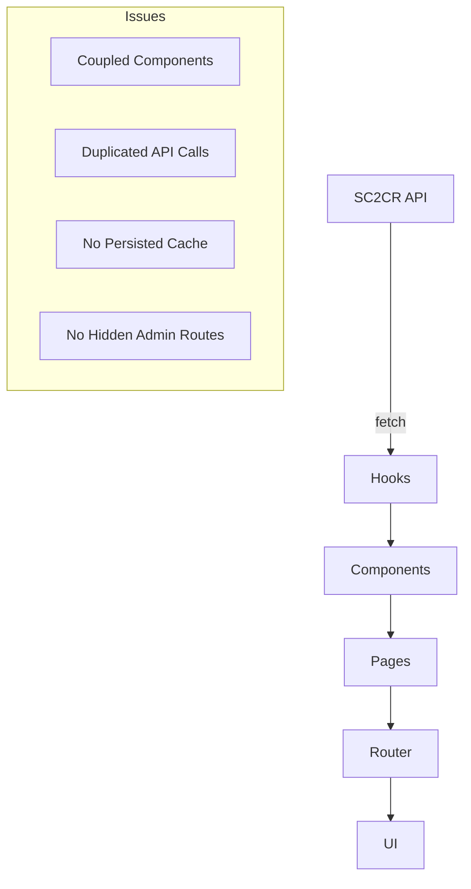

# Current Front-End Architecture

## Component & Page Structure
- Components: `src/client/components/`
- Pages: `src/client/pages/`
- Hooks: `src/client/hooks/`
- Services: `src/client/services/`
- State Management: Context API, local state
- Routing: React Router (assumed)

## Bottlenecks & Coupling Issues
- Some components tightly coupled to data fetching logic
- Duplicated API calls in hooks and components
- Lack of clear separation between data services and presentation
- Minimal caching; mostly direct API calls
- No persisted client cache for snapshot/history
- Admin tools not separated; no hidden routes

## Diagram: Current Architecture

