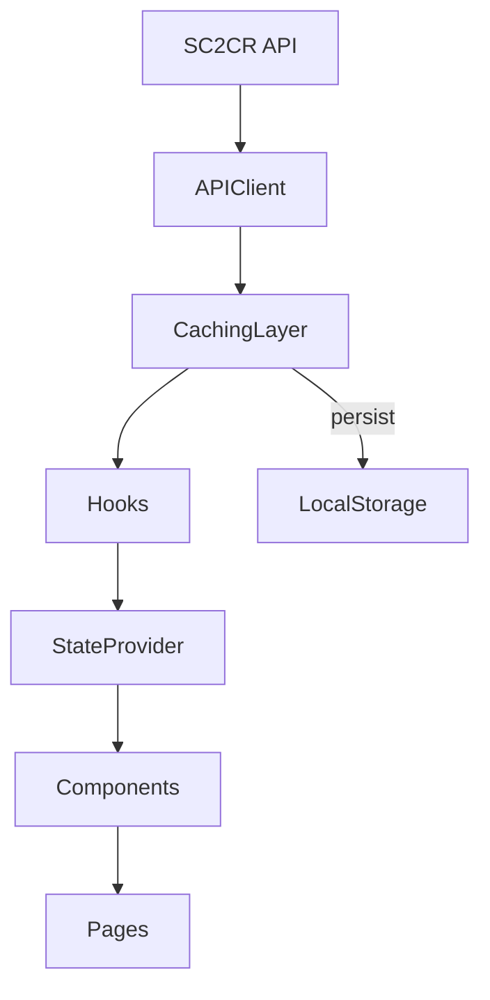

# Data Flow & Client-Side Caching

## Data Flow
1. SC2CR API → API Client → Caching Layer → Hooks → State Provider → Components → Pages → UI
2. Admin features accessed via hidden routes, with future role-based access planned

## Data Schemas/Interfaces
- Activity classifications, streaks, rollups
- Example:
```ts
interface ActivityClassification {
  playerId: string;
  activityLevel: 'low' | 'medium' | 'high';
  streak: number;
  lastActive: string;
}
```

## Caching & Retention
- In-memory TTL: 5–15 min for frequent queries
- Persisted cache: 1–7 days for snapshot/history
- Clean-up: On logout, manual refresh, or TTL expiry

## Diagram: Data Flow & Caching

