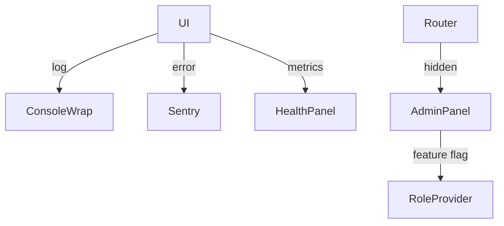

# Observability & Admin Access

## Logging & Error Monitoring
- Use console wrap for local logging
- Integrate Sentry (or similar) for error monitoring
- Health checks: API call success/failure, loading times
- Metrics: Client performance, API failures

## Schedulers & Backups
- Periodic refresh for key data (configurable interval)
- Offline caching for snapshot/history
- Monitor scheduler health via UI panel

## Admin Access
- Hidden routes for admin tools (e.g., `/admin/metrics`)
- Feature flags for admin modules
- Plan for future role-based access (user context, permissions)

## Diagram: Admin & Observability

