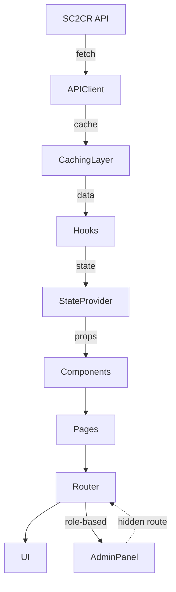

# Target Front-End Architecture

## Modular Layers & Services
- **API Client Layer:** Centralized fetch logic, error handling, query param support
- **Caching Layer:** In-memory TTL cache for frequent data; persisted cache (localStorage) for snapshots/history
- **State Management:** Context providers for global state, user/session
- **Hooks:** Reusable hooks for data fetching, derived metrics
- **Presentation Components:** Pure UI, charts, tables
- **Pages:** Feature views, admin panels
- **Admin Module:** Hidden routes, future role-based access

## Caching Strategies
- In-memory TTL for frequently accessed data
- Persisted cache for snapshot history (localStorage)
- Cache keys aligned with API query params/pagination

## Feature Integration
- Ranking, player search/profiles, head-to-head, analytics, snapshot history, admin/observability
- Pagination/query param support at all layers
- Hidden-route feature flags for admin

## Diagram: Target Architecture

